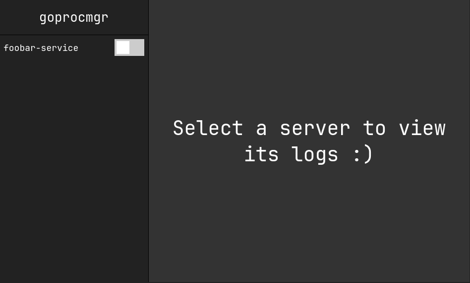

# goprocmgr

This program is a configuration manager and process runner for servers, it
has an http API to manage and retrieve the configuration. It also provides a
CLI client for interacting with the API.

It's inspired by [Chalet](https://github.com/jeansaad/chalet) which is a fork
from [Hotel](https://github.com/typicode/hotel). However, this aims to be way
simpler in design, feature set and implementation.

## Features

- Remember configured "servers" by storing certain environment variables, directory and command to run to start it.
- Start, stop and read logs from the different servers.
- Simple http API to interact with the servers.
- Command line tool to interact with the API.
- Web UI to interact with the API.
- Random port assignment for servers with the environment variable `PORT`.

## Lack of Proxy

Unlike `hotel` and `chalet` this program does not provide a proxy to the
running servers. This is a design choice bauces then we would need to listen
to port 80 and 443 which would require root access. This would also require
to support TLS and certificates. So there's just a whole bunch extra work.

So instead we just provide a random port to the server as an environment
variable, then you'll be able to use that in the startup of your application.

In the list of running servers in the web UI you can click the link to the
service to access it.

If you're running multiple services with docker you can make sure to put
all your services on the same host network and then use something like
[jwilder/nginx-proxy](https://hub.docker.com/r/jwilder/nginx-proxy/) to
map the services up and have local domains to access all your services
through the same port, just with different domains (like `service1.local`).

## TODO

- [X] Implement `direnv` support `direnv exec $dirname $command`.
- [X] Implement keybind support in the web interface (`esc` to unselect server,
      `t` to toggle server, `n` for next server, `p` for previous server).
- [X] Implement an overview of the keybind in the web interface (press `h` to display popup).
- [X] Refresh data and interface over websockets.
- Improve the kill check for stopped processes.
- Implement a getting started overview in the web interface on the frontpage.
